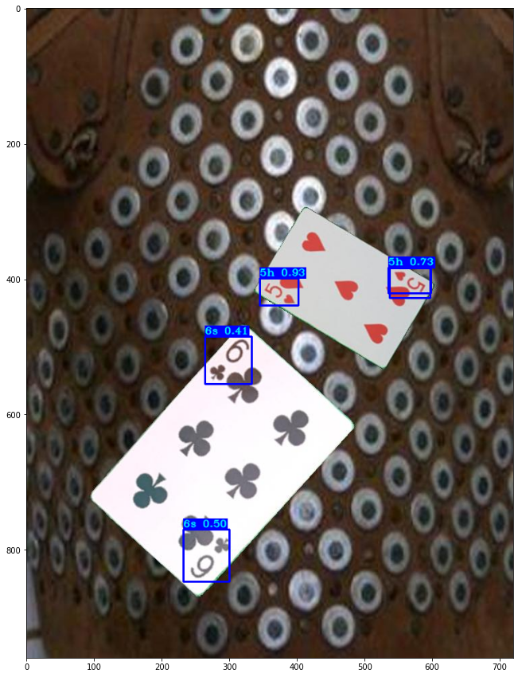

# Cards recognition

## Introduction
We wanted to identify which cards is on a picture.

Firstly, we created a datasets using image processing. I took pictures of 52 cards with different lightings, then used cantour detection to crop out the cards and put them on different background while record their position into a text file and then to the XML format to feed into the model. Here is an example of the genareted dataset

It is important to note that we want to detect only the small parts at the corners of the cards, as sometimes the other parts are covered. After feeding the dataset into the model, we will get the result and here is an example of the result:

## Library

## Structure and Components
- `create_datasets/create_datasets.py`: Create datasets with captured image 
- `model_data/coco`: Testing data for yolov3
- `tools/XML_to_YOLOv3.py`: prepare data (position in image) for the model
- `YOLOv3_colab_training.py`: train data in google colab 
- `train.py`: train data without google colab
- `other files`: yolov3 supplement files

